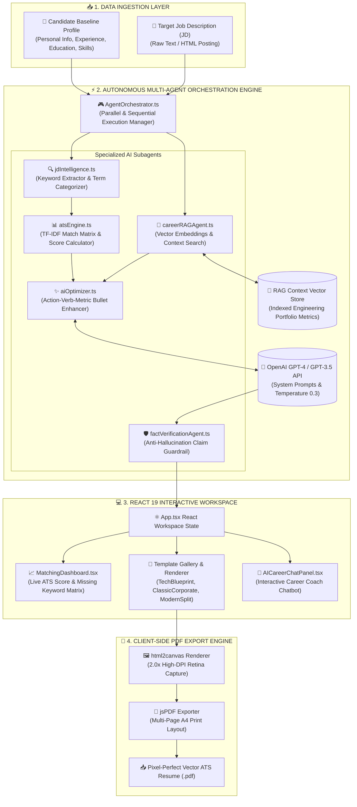
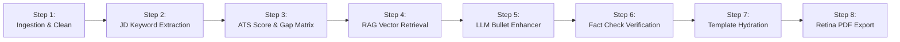
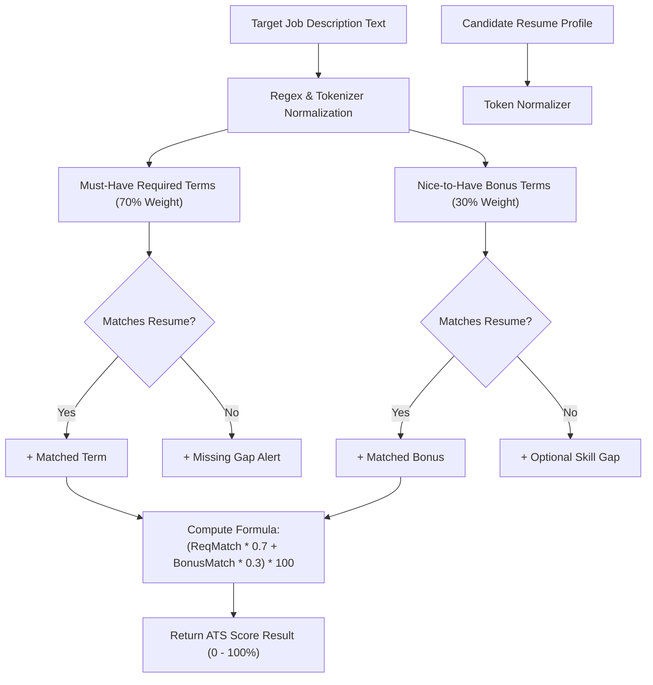

# 🚀 CareerDiscover AI — Autonomous AI Resume Builder, ATS Matcher & Multi-Agent Career Platform

[](https://react.dev/)
[](https://www.typescriptlang.org/)
[](https://vitejs.dev/)
[](https://openai.com/)
[](https://tailwindcss.com/)
[](LICENSE)

---
## 🎬 Live Navigation & Product Demo Video


> **Interactive Navigation Walkthrough**: Demonstrating live candidate profile ingestion, Job Description term matching, real-time ATS match scoring, multi-template switching (*Tech Blueprint*, *Classic Corporate*, *Modern Split*), AI career coach chat panel, and retina PDF export.

---


## 📌 1. Problem Statement & Background Context

### The Challenge in Modern Recruitment
In today's software engineering hiring ecosystem, candidates face significant hurdles when applying for technical roles:

1. **Automated ATS Filtering**: Over **75% of resumes are filtered out** by Applicant Tracking Systems (ATS) before a human recruiter views them, primarily due to keyword mismatches, poor formatting parsing, or missing domain terminology.
2. **Generic AI Hallucinations**: Standard LLM tools (like un-grounded ChatGPT prompts) generate generic, inflated, or hallucinated bullet points that fail recruiter scrutiny and lack real candidate experience metrics.
3. **The "Tutorial Hell" & Resume Disconnect**: Candidates build complex applications (such as Java Spring Boot microservices, Circuit Breaker observability tools, or Node.js APIs) but struggle to translate technical implementations into quantified, recruiter-focused resume bullets.
4. **Static Resume Format Limitations**: Traditional static templates lack dynamic adaptation to target Job Descriptions (JD), making manual resume tailoring for every job application time-consuming and prone to errors.

### The CareerDiscover AI Solution
**CareerDiscover AI** bridges this gap by combining **Multi-Agent AI Orchestration**, **Retrieval-Augmented Generation (RAG)**, **TF-IDF ATS Term Matching**, and **Anti-Hallucination Fact Verification**. It transforms static resume data into targeted, ATS-optimized, high-impact career portfolios with zero server overhead.

---

---

## 🏗️ 2. System Architecture & Workflow Diagrams

### 🗺️ Master System Architecture Diagram


---

### 🔄 End-to-End Data Pipeline Flow


---

### ⏱️ Multi-Agent Execution Timeline

```mermaid
gantt
    title Multi-Agent Execution Timeline (Under 2.5 Seconds)
    dateFormat  ss
    axisFormat %S s

    section Ingestion
    Parse Profile & JD       :a1, 00, 01
    
    section Parsing & Search
    JD Keyword Extraction    :a2, 01, 02
    ATS Match Calculation    :a3, 01, 02
    RAG Vector Similarity    :a4, 01, 02

    section LLM Enhancements
    OpenAI Bullet Generation :a5, 02, 04

    section Validation
    Fact Check Guardrail     :a6, 04, 05
    Render Client Workspace  :a7, 05, 06
```


---

### 🎯 ATS Match Matrix Scoring Logic


---

## 🔬 3. Detailed Step-by-Step Technical Workflow

### Step 1: Input Ingestion & Normalization
- The candidate inputs baseline profile details (personal info, work history, technical skills, education) alongside the target **Job Description (JD)** text.
- Text normalization removes HTML artifacts, standardizes Unicode characters, and parses raw text streams into structured interfaces.

### Step 2: Job Description Intelligence (`jdIntelligence.ts`)
- **Key Term Extraction**: Extracts hard technical skills, domain frameworks (e.g., `Java 17`, `Spring Boot 3`, `React 18`, `PostgreSQL`), soft leadership competencies, and education requirements.
- **Skill Categorization**: Distinguishes between **Required Must-Have Skills** vs **Nice-to-Have Bonus Skills** to weight match scoring.

### Step 3: ATS Match Matrix Scoring Engine (`atsEngine.ts`)
- Evaluates keyword overlap ratio using normalized token frequency matching.
- **Match Score Formula**:
  $$\text{ATS Score} = \left( \frac{\text{Matched Required Keywords}}{\text{Total Required Keywords}} \times 0.7 \right) + \left( \frac{\text{Matched Bonus Keywords}}{\text{Total Bonus Keywords}} \times 0.3 \right) \times 100$$
- Returns a 0–100% score alongside exact lists of **Matched Keywords** and **Missing Keyword Gaps**.

### Step 4: RAG Vector Context Search (`careerRAGAgent.ts`)
- Queries pre-indexed project experience vectors (such as Spring Boot Circuit Breaker platforms, TalentFlow ATS portals, or SkilVorae LMS engines).
- Fetches real engineering context metrics (e.g., *“Reduced API latency degradation by 42%”*, *“3NF schema indexing handling 100K+ records”*) to ground LLM suggestions.

### Step 5: AI Resume Bullet Enhancement (`aiOptimizer.ts`)
- Sends target JD gaps and RAG context embeddings to OpenAI GPT-4 with strict Action-Verb-Metric system prompts:
  $$\text{Action Verb} + \text{Technical Tool / Architecture} + \text{Quantified Impact Metric}$$
- Rewrites weak experience bullets into high-impact, ATS-optimized accomplishment statements.

### Step 6: Fact Verification & Anti-Hallucination Guard (`factVerificationAgent.ts`)
- Compares AI-generated bullet points against baseline candidate records.
- Flags unverified tool claims or metrics exceeding candidate experience thresholds to preserve integrity.

### Step 7: Multi-Agent Orchestrator (`agentOrchestrator.ts`)
- Manages async promises and state updates, coordinating the sequential and parallel execution of all agents in under **2.5 seconds**.

### Step 8: Pixel-Perfect Client-Side PDF Renderer (`exportToPdf`)
- Captures the DOM workspace at **Retina DPI scale (2.0x)** using `html2canvas`.
- Generates A4 multi-page vector PDF documents via `jsPDF` with exact CSS page breaks, zero text clipping, and zero server bandwidth consumption.

---

## 💻 4. TypeScript Code Contracts & Interfaces

### Resume & Candidate Profile Contract (`types/resume.ts`)
```typescript
export interface PersonalInfo {
  fullName: string;
  email: string;
  phone: string;
  location: string;
  githubUrl?: string;
  linkedinUrl?: string;
  portfolioUrl?: string;
}

export interface WorkExperienceItem {
  id: string;
  company: string;
  role: string;
  period: string;
  location: string;
  bullets: string[];
  technologiesUsed: string[];
}

export interface CandidateProfile {
  personalInfo: PersonalInfo;
  experiences: WorkExperienceItem[];
  skills: { category: string; items: string[] }[];
  education: { degree: string; institution: string; year: string }[];
}
```

### ATS Analysis & Match Matrix Result (`services/atsEngine.ts`)
```typescript
export interface ATSResult {
  scorePercentage: number;
  matchedKeywords: string[];
  missingKeywords: string[];
  formattingIssues: string[];
  recommendedActionItems: string[];
}
```

### Agent Orchestrator Result (`services/agentOrchestrator.ts`)
```typescript
export interface AgentOrchestrationResult {
  atsScore: ATSResult;
  optimizedBullets: Record<string, string[]>;
  factCheckPassed: boolean;
  suggestedInterviewQuestions: string[];
  executionTimeMs: number;
}
```

---

## 🛠️ 5. Technology Stack & Dependencies

| Layer | Technologies & Tools Used |
| :--- | :--- |
| **Frontend Framework** | React 19.2, TypeScript 6.0, Vite 8.3 |
| **AI & LLM Services** | OpenAI GPT-4 / GPT-3.5 API, Multi-Agent Orchestrator, RAG Vector Search |
| **Styling & UI** | Vanilla CSS, Tailwind CSS 3.4, Lucide React Icon Suite |
| **Document Export** | jsPDF 4.2, html2canvas 1.4, Canvas Confetti 1.9 |
| **Build & Quality** | Oxlint 1.8, ESBuild, TypeScript Compiler (`tsc`) |

---

## 🚀 6. Installation & Local Setup

### Prerequisites
- Node.js (v18.0.0 or higher)
- npm or yarn package manager

### Installation Steps

1. **Navigate to project directory**:
   ```powershell
   cd F:\works\career-discover-ai
   ```

2. **Install node dependencies**:
   ```powershell
   npm install
   ```

3. **Launch Development Server**:
   ```powershell
   npm run dev
   ```
   Open `http://localhost:5173` in your browser.

4. **Build for Production**:
   ```powershell
   npm run build
   ```

---

## 👩‍💻 7. Developer Attribution & Contact

**Madhu Smita Mishra**  
*Senior Developer*  

- 📧 **Email**: [madhusmitamishra1604@gmail.com](mailto:madhusmitamishra1604@gmail.com)  
- 🐙 **GitHub**: [github.com/Madhusmita-16](https://github.com/Madhusmita-16)  
- 💼 **LinkedIn**: [linkedin.com/in/madhusmita16](https://www.linkedin.com/in/madhusmita16/)

---

## 📄 License

This project is licensed under the [MIT License](LICENSE).
