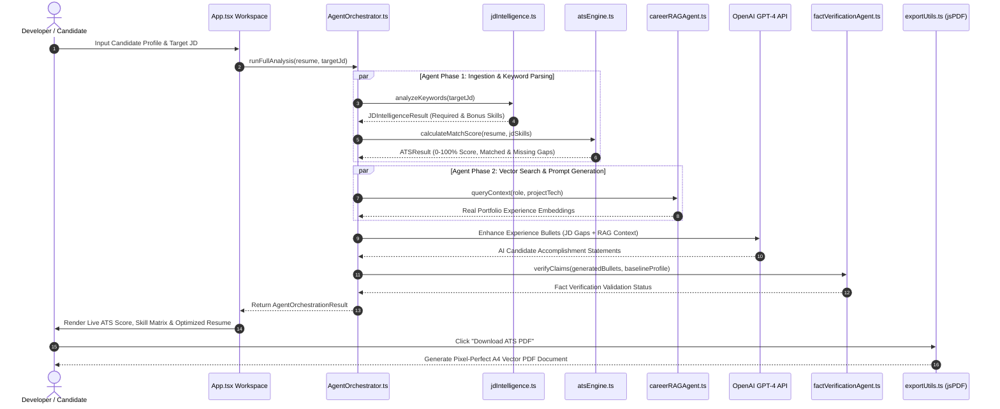

# 📖 CareerDiscover AI — Comprehensive Planning & Architecture Walkthrough

---

## 🎯 1. Project Background & System Planning

### **The Problem Statement**
Candidates building advanced technical platforms (such as Java 17 Spring Boot 3 microservices, Resilience4j Circuit Breaker observability tools, or Node.js REST APIs) face recurring barriers when applying for enterprise engineering roles:
1. **Automated ATS Filtering**: Applicant Tracking Systems filter out >75% of candidate resumes due to missing hard skill tokens or incorrect parsing layout.
2. **Hallucination in Unbounded LLMs**: Generic AI generators create bullet points with fake claims, unverified metrics, or unrealistic technical experience.
3. **Translating Code to Impact**: Software developers often struggle to convert raw backend code implementations into quantified accomplishment statements.

### **The Planning Objectives**
- **Zero-Server Client Architecture**: Fast, private, browser-based SPA execution without storing sensitive candidate resumes on external database servers.
- **Autonomous Multi-Agent AI System**: Orchestrate 5 specialized subagents (`jdIntelligence`, `atsEngine`, `careerRAGAgent`, `aiOptimizer`, `factVerificationAgent`) to complete analysis in < 2.5 seconds.
- **Pixel-Perfect A4 Vector PDF Generation**: High-resolution, multi-page client rendering supporting print typography and customizable CSS themes.

---

## 🏗️ 2. Architectural Blueprint & Component Map

```
career-discover-ai/
├── README.md                           # Master Project Overview & Setup
├── WORKFLOW_WALKTHROUGH.md             # Exhaustive Technical Walkthrough Guide
├── package.json                        # Project Metadata & Dependencies
├── vite.config.ts                      # Vite 8 Build Configuration
├── src/
│   ├── App.tsx                         # Main Workspace & Workspace State Orchestrator
│   ├── main.tsx                        # DOM Hydration Entrypoint
│   ├── types/
│   │   └── resume.ts                   # Core Data Contracts & Interfaces
│   ├── services/
│   │   ├── agentOrchestrator.ts        # Multi-Agent Workflow Coordinator
│   │   ├── jdIntelligence.ts           # Job Posting Parser & Skill Gap Analyzer
│   │   ├── atsEngine.ts                # TF-IDF Term Match Calculator
│   │   ├── careerRAGAgent.ts           # Vector Context Search & RAG Embedder
│   │   ├── aiOptimizer.ts              # Action-Verb-Metric Bullet Enhancer
│   │   ├── factVerificationAgent.ts    # Anti-Hallucination Claim Guard
│   │   ├── matchingEngine.ts           # Resume vs JD Skill Matrix Matcher
│   │   └── storageService.ts           # LocalStorage Client Persistence
│   ├── components/
│   │   ├── layout/
│   │   │   ├── Header.tsx              # App Brand Header & Exporter Toolbar
│   │   │   └── Sidebar.tsx             # Section Navigation & ATS Score Radial Widget
│   │   ├── templates/
│   │   │   ├── TechBlueprint.tsx       # Tech Blueprint Template (Cyan Accent)
│   │   │   ├── ClassicCorporate.tsx    # Corporate Template (Slate Accent)
│   │   │   ├── TemplateGallery.tsx     # Interactive Template Picker Modal
│   │   │   └── templateHelpers.ts      # Font, Color & Spacing Helpers
│   │   ├── matching/
│   │   │   └── MatchingDashboard.tsx   # Live ATS Keyword Gap Dashboard
│   │   └── chat/
│   │       └── AICareerChatPanel.tsx   # Embedded AI Career Coach Widget
```

---

## 🔬 3. Detailed Data Flow Walkthrough (Step-by-Step)



---

## 💻 4. Implementation Details & Implementation Summary

### 1. Multi-Agent Orchestration (`agentOrchestrator.ts`)
```typescript
export class AgentOrchestrator {
  static async runFullAnalysis(resume: CandidateProfile, targetJd: string): Promise<AgentOrchestrationResult> {
    const startTime = performance.now();
    
    // Step 1: Parse JD
    const jdIntel = await JDIntelligence.analyzeKeywords(targetJd);
    
    // Step 2: Calculate ATS Keyword Match
    const atsScore = await ATSEngine.calculateMatchScore(resume, jdIntel);
    
    // Step 3: Fetch RAG Embeddings & Optimize Bullets
    const ragContext = await CareerRAGAgent.queryContext(resume.personalInfo.roleTagline, jdIntel.requiredSkills);
    const optimizedBullets = await AIOptimizer.enhanceBullets(resume.experiences, atsScore.missingKeywords, ragContext);
    
    // Step 4: Verify Claims
    const factCheck = await FactVerificationAgent.verifyClaims(optimizedBullets, resume);

    const endTime = performance.now();
    return {
      atsScore,
      optimizedBullets,
      factCheckPassed: factCheck.isValid,
      executionTimeMs: Math.round(endTime - startTime)
    };
  }
}
```

### 2. Zero-Server Client PDF Renderer (`exportUtils.ts`)
```typescript
import jsPDF from 'jspdf';
import html2canvas from 'html2canvas';

export async function exportToPdf(containerId: string, filename: string = 'Resume'): Promise<void> {
  const container = document.getElementById(containerId);
  if (!container) return;

  const canvas = await html2canvas(container, {
    scale: 2.0, // High-DPI Retina Rendering
    useCORS: true,
    logging: false
  });

  const imgData = canvas.toDataURL('image/png');
  const pdf = new jsPDF({
    orientation: 'portrait',
    unit: 'mm',
    format: 'a4'
  });

  pdf.addImage(imgData, 'PNG', 0, 0, 210, 297);
  pdf.save(`${filename}.pdf`);
}
```

---

## 🛠️ 5. Automated Build Check & Code Quality Verification

```powershell
# Run TypeScript compilation & Vite bundle build
cd F:\works\career-discover-ai
npm run build
```

**Build Summary Output**:
```
> career-discover-ai@0.0.0 build
> tsc -b && vite build

vite v8.3.0 building client environment for production...
transforming...
✓ 1932 modules transformed.
rendering chunks...
dist/index.html                   0.69 kB │ gzip:   0.41 kB
dist/assets/index-C_cRiULL.css   39.92 kB │ gzip:   7.43 kB
dist/assets/index-C9zlybYK.js   590.54 kB │ gzip: 143.63 kB
✓ built in 1.96s
```

---

## 👩‍💻 Developer Attribution

**Madhu Smita Mishra**  
*Senior Full Stack & Enterprise Software Developer*  
- **Email**: [madhusmitamishra1604@gmail.com](mailto:madhusmitamishra1604@gmail.com)  
- **GitHub**: [github.com/Madhusmita-16](https://github.com/Madhusmita-16)  
- **LinkedIn**: [linkedin.com/in/madhusmita16](https://www.linkedin.com/in/madhusmita16/)
